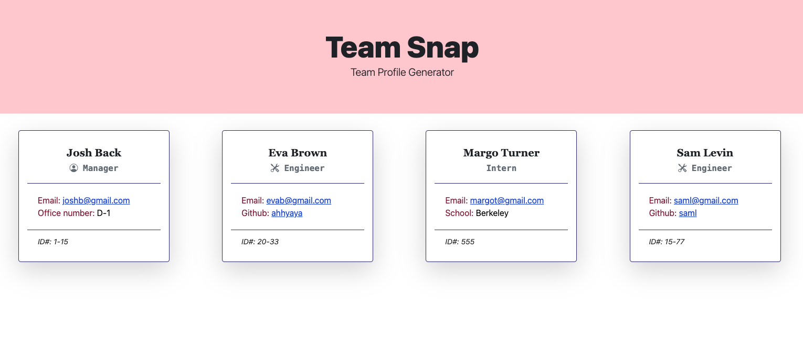

# Team Snap 

  ## Table of contents:
  ### 
  1. [Description](#description)
  3. [Features](#features)
3. [Installation](#installation)
4. [Demo](#demo)
5. [License](#license)
6. [Contribution](#contribution)
7. [Tests](#tests)
8. [Questions](#questions)

  ---

  ## Description 
  ### A Node.js command-line application that takes in information about employees on a software engineering team and generates an HTML webpage that displays summaries for each person. Simply generate a webpage that displays my team's basic info.
  ---
  ## Features

   * GIVEN a command-line application that accepts user input
   * email program opens and populates the TO field of the email with the address
   * GitHub profile opens in a new tab
   
  ---
  ## Installation
   * inquirer package (npm i inquirer@8.2.4), 
   * Jest package (npm i jest), 
   * bootstrap icon package (npm i bootstrap-icons)
  ---

  ## Demo

  https://user-images.githubusercontent.com/113266025/197427433-9479aec5-d56b-41fe-bfd7-1f2a79c965ae.mp4

  ---

  ## License
  ### MIT
  * Read more about MIT: https://opensource.org/licenses/MIT 

  ---

  ## Contribution
  * Ruihan Gao
  ---

  ## Command to Run Tests
  * npm run test
  ---
  
  ## Questions
  ### Reach me with additional questions:
  * Github Link: https://github.com/ahhyaya
  * Project Link: https://github.com/ahhyaya/Team-Snap
  * Email Address: toruig59@gmail.com
